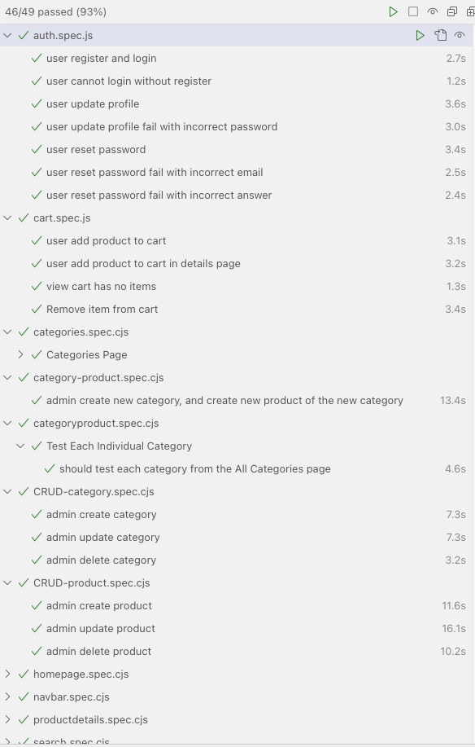
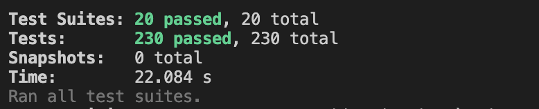

# Group 9

Kim YongBeom, Ng Rui Jie Solomon, Sim Wei Peng Eric

## Setup Instructions

1. In the root directory, create a `.env` file and copy the contents from the submitted zip file.
2. Run `npm install` in the root directory.
3. Navigate to the `client` directory and run `npm install`.
4. Return to the root directory and run `npm run dev`.
5. The application should start on `http://localhost:3000`.

## Github CI workflow

[Github CI workflow](https://github.com/cs4218/cs4218-2420-ecom-project-team09/actions/runs/13748324617/job/38446420228)

## Running UI Test

1. UI test are located in `test/ui-tests`
2. Start the application by running `npm run dev`
3. On a separate terminal, run `npx playwright test --ui`
4. Wait for the PlayWright Test popup, and click on the play button
5. It is a known issue that UI test may be flaky due to latency of the website. We seek your understanding. Please rerun the UI test if any fails.

## Running Integration Test

1. Integration test are located in `test/integration`
2. To run integration test, do `npm run test:backend`. The integration test will run alongside backend unit tests.

